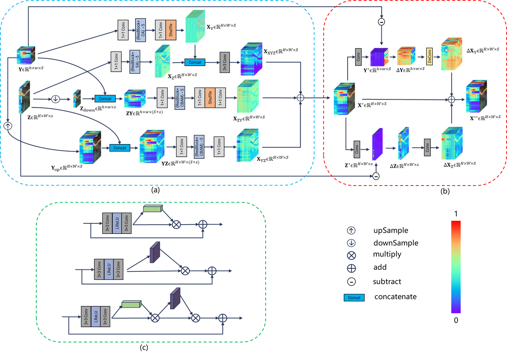

# MSSJFL
# Multiscale Spatial-spectral Joint Feature Learning for Multispectral and Hyperspectral Image Fusion
Abstract: For RGB image super-resolution, usually operates on a single image. However, due to a large number of spectral bands and high dimensionality of the data in hyperspectral images (HSIs), it is difficult for a single image super-resolution to improve spatial resolution without spectral distortion. Therefore, it is necessary to fuse spatial features of multispectral images (MSIs) to improve spatial resolution. In this paper, we take advantage of the end-to-end advantages of deep learning and propose multiscale spatial-spectral joint feature learning (MSSJFL) for multispectral and hyperspectral image fusion. MSSJFL method utilizes different scale feature learning to exact single spatial feature, spectral feature, spatial-spectral joint feature, and then restore spectral information and spatial details via feature restoration module. Experimental results demonstrate that the proposed network architecture achieves better performance compared with state-of-the-art HSI and MSI fusion. The classification accuracy of the fusion result on the real HSI dataset is also closest to the ground truth.

